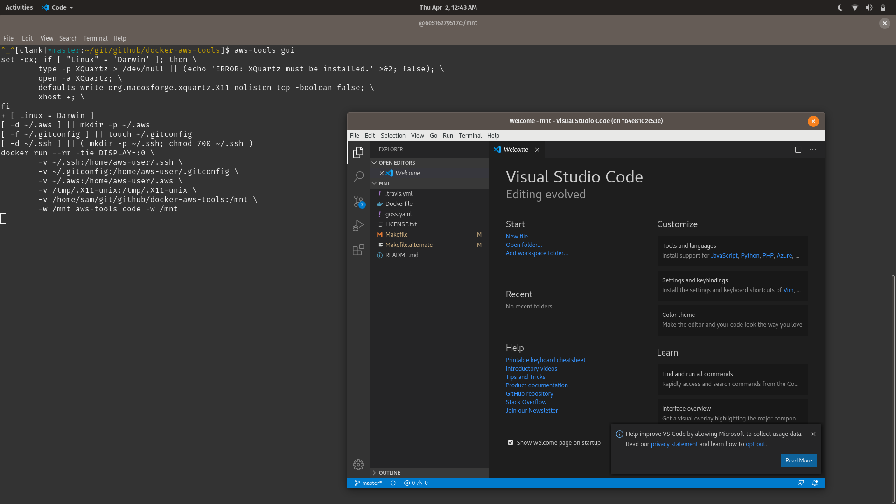

# Common AWS Dev Tools [![Build Status][build-status]][build-url]

This provides a neat package for having AWS development utilities on your
computer without having to install all of the heavy requirements directly.

Features:

* Get started with developing AWS infrastructure code quickly.
* Integrates with your shell environment to be launched from any project.  (via
  [cli alias](#aws-tools-command-alias))
* Running VS Code IDE from inside of a docker container.
* Fast cleanup, just delete the docker image via `make clean`.

# Usage

Running `make` without arguments will give you the following usage.

```
The following make commands are available
    make cli   - shows a CLI.
    make gui   - shows a VS Code editor (requires X11 or XQuartz on Mac).
    make test  - runs infra tests against the aws-tools docker image.
    make clean - Removes docker image created.
```

# Getting started

* [CDK workshop](https://cdkworkshop.com/30-python/20-create-project/100-cdk-init.html)
* [CDK examples](https://github.com/aws-samples/aws-cdk-examples)

# What is available?

[CentOS 8][cent] is the operating system provided with root access via sudo.

System tools:

* [Node JS][js] - dependency for CDK
* [Python 3][py] - dependency for AWS CLI and cfn-init
* [VS Code][code] - Microsoft VS Code for an IDE.
* [X11][X] - To run VS Code inside of the container.  On Mac OS X, you need to
  install [XQuartz][XQ] for this to work.
* [dumb-init][Yelp] - lightweight /sbin/init process
* [git][git]
* [goss][goss] - infrastructure test utility
* [jq][jq] - JSON parsing CLI utility
* vim - A CLI editor.  Run `vimtutor` to learn more.

AWS Tools Provided:

| Latest version | Additional Information |
| -------------- | ---------------------- |
|         | [AWS CDK][cdk] |
|           | [AWS CLI][cli] |
|  | [cfn-lint][lint] - a CloudFormation stack linter. |

# aws-tools command alias

You can install this into your system for development as an `aws-tools` command.
Please note, the following commands are meant to be run from the root of this
repository so that it properly evaluates the path.

On Linux,

    make build
    echo "alias aws-tools='make -f \"$PWD\"/Makefile.alternate'" >> ~/.bashrc

On Mac OS X,

    make build
    echo "alias aws-tools='make -f \"$PWD\"/Makefile.alternate'" >> ~/.bash_profile

The next time you open your terminal you'll have the `aws-tools` command
available.

    aws-tools cli
    aws-tools gui

# Screenshot

Running VS Code from a docker container on Pop! OS 18.04 GNU/Linux.



# Troubleshooting

Q: Slowness of VS Code on Mac OS X when running `make gui` or `aws-tools gui`.

* A: Not much I can do about that with XQuartz.  There's currently an [open
  XQuartz issue][xquartz-slowness].  Consider X11 support for this
  unstable/experimental.  Using a Linux distro or a Linux VM on Mac is best.

Q: Can't connect to X session from Mac.

* A: Go to XQuartz settings under security and enable `Authenticate sessions`
  and enable `Allow connections from network clients`.

[MIT Licensed](LICENSE.txt)

[XQ]: https://www.xquartz.org/
[X]: https://www.x.org/
[Yelp]: https://github.com/Yelp/dumb-init
[build-status]: https://travis-ci.com/samrocketman/docker-aws-tools.svg?branch=master
[build-url]: https://travis-ci.com/samrocketman/docker-aws-tools
[cdk]: https://aws.amazon.com/cdk/
[cent]: https://www.centos.org/about/
[cli]: https://aws.amazon.com/cli/
[code]: https://code.visualstudio.com/
[git]: https://git-scm.com/
[goss]: https://github.com/aelsabbahy/goss
[jq]: https://stedolan.github.io/jq/
[js]: https://nodejs.org/
[lint]: https://github.com/aws-cloudformation/cfn-python-lint
[py]: https://www.python.org/
[xquartz-slowness]: https://gitlab.freedesktop.org/xorg/xserver/-/issues/188
